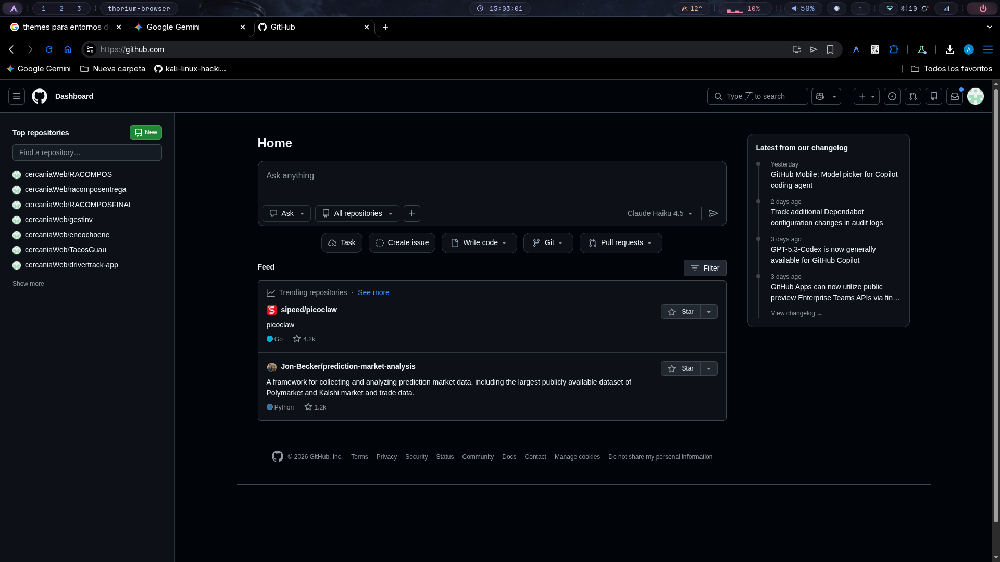
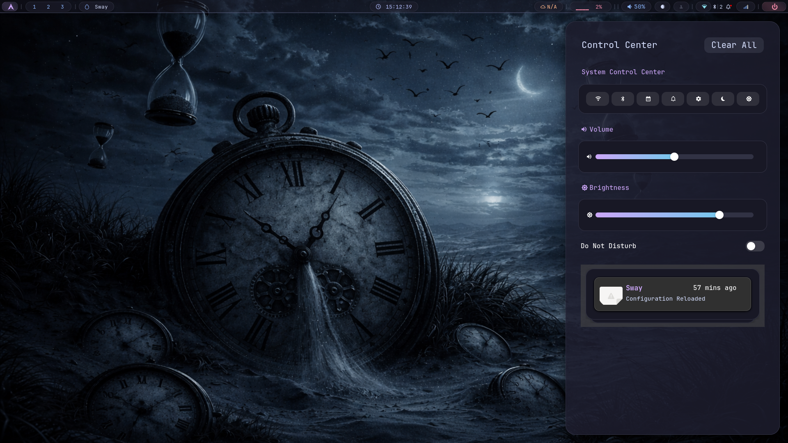
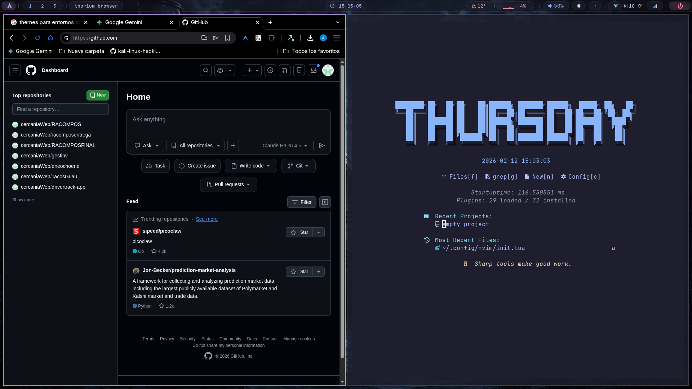
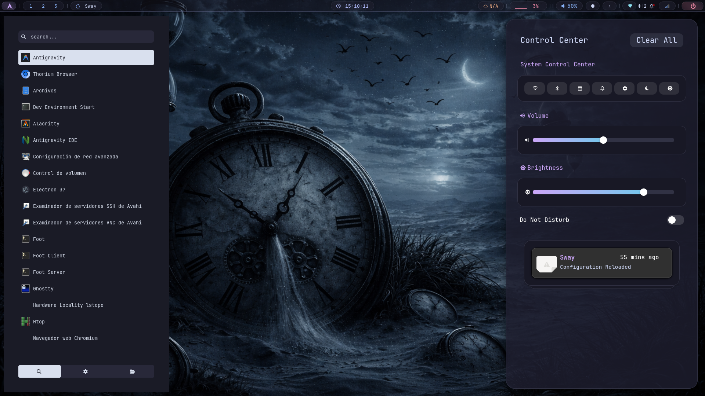
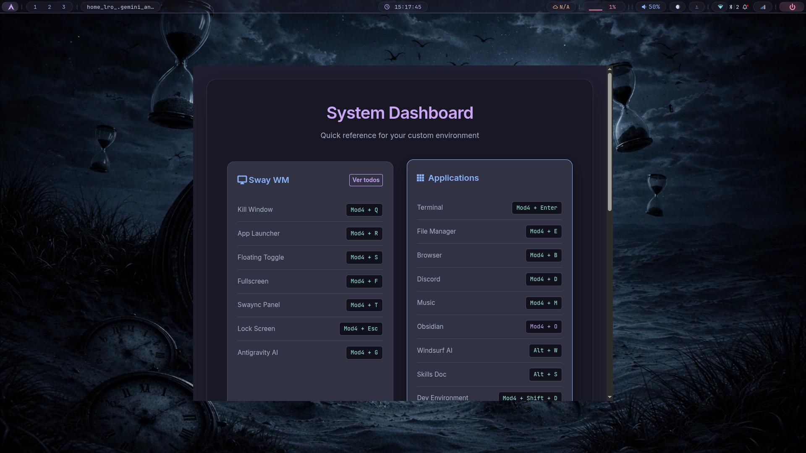

# ❄️ Catppuccin Mocha Dotfiles | Arch + Sway

> A premium, minimalist, and hyper-optimized development environment for Arch Linux (Wayland).


---

## 📸 Showcase

### 🖥️ Desktop Overview


### 🔔 Control Center & Notifications


###  Neovim (Mocha Theme)


### 🚀 Full Environment (Launcher + Control Center)


### 📊 Interactive Shortcut Dashboard


---

## ✨ Features

- **🎨 Theme**: Catppuccin Mocha everywhere (Terminal, WM, Sidebar).
- **🚀 Performance**: Hyper-optimized for 8GB RAM with **Zram (4GB)** and kernel tweaks.
- **🐚 Shell**: Fish + Starship + Tmux for a fluid CLI experience.
- **🖥️ OSD**: Custom SwayOSD with minimalist pink/magenta aesthetic.
- **🔔 Notifications**: SwayNC with system stats and premium control center.
- **💻 Editor**: Neovim (LazyVim based) optimized for low resource usage.

---

## 🛠️ Performance Optimization (Zram)

Special kernel parameters applied in `/etc/sysctl.d/99-zram-optimization.conf`:
- `vm.swappiness = 180`: Prioritizes Zram over physical RAM.
- `vm.vfs_cache_pressure = 50`: Improves file system cache retention.
- `vm.page-cluster = 0`: Optimized for Zram decompression.

---

## 📦 What's Included?

| Component | Tool | Description |
|-----------|------|-------------|
| Window Manager | **Sway** | Wayland compositor (Mocha themed) |
| Bar | **Waybar** | Fully customized with module drawers |
| Notifications | **SwayNC** | Notification center + system widgets |
| Terminal | **Alacritty** | GPU accelerated terminal + Tmux |
| Shell | **Fish** | Friendly interactive shell with Starship |
| OSD | **SwayOSD** | Minimalist Volume/Brightness feedback |

---

## 📥 Installation

1. **Clone the repository**:
   ```bash
   git clone https://github.com/cercaniaWeb/sway-liviano.git ~/dotfiles
   cd ~/dotfiles
   ```

2. **Install Dependencies (Arch Linux/AUR)**:
   ```bash
   chmod +x install_deps.sh
   ./install_deps.sh
   ```

3. **Deploy Configs**:
   ```bash
   chmod +x setup.sh
   ./setup.sh
   ```

---

## 📜 Repository Structure

```text
.
├── alacritty/      # Alacritty config (TOML)
├── bin/            # Custom helper scripts (micctl, etc)
├── fish/           # Fish shell configuration
├── sway/           # Sway WM keybindings and rules
├── swaync/         # Notification Center CSS and JSON
├── swayosd/        # SwayOSD custom theme
├── sysctl/         # Kernel optimizations for 8GB RAM
├── tmux/           # Tmux session management
└── waybar/         # Global Wayland bar config
```

---

*Made with ❤️ by Antigravity AI*
